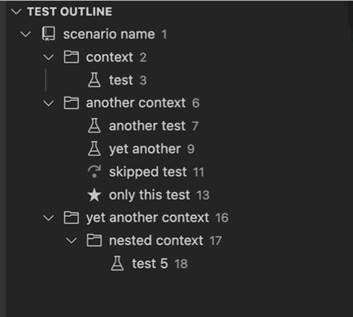

# test-outline for JS Tests

Outline for Cypress, Mocha, Jest and Playwright tests.

## Features

- Shows all levels of `describe`, `context` and `it` in a simple overview
- Right-click to add/remove `.only`
- Right-click to add/remove `.skip`

## Supported keywords

| Keyword | Type | Frameworks |
|---|---|---|
| `describe`, `describe.skip`, `describe.only` | Group | Mocha, Jest, Cypress, Playwright |
| `suite`, `suite.skip`, `suite.only` | Group | Mocha |
| `context`, `context.skip`, `context.only` | Group | Mocha, Cypress |
| `xdescribe` | Group (skipped) | Mocha, Jest |
| `test.describe`, `test.describe.skip` | Group | Playwright |
| `it`, `it.skip`, `it.only` | Test | Mocha, Jest, Cypress |
| `test`, `test.skip`, `test.only` | Test | Jest, Playwright |
| `specify`, `specify.skip`, `specify.only` | Test | Mocha |
| `xit`, `xtest` | Test (skipped) | Mocha, Jest |

Activates for files matching `*.test.ts`, `*.test.js`, `*.spec.ts`, `*.spec.js`, `*.cy.ts`, `*.cy.js`.
